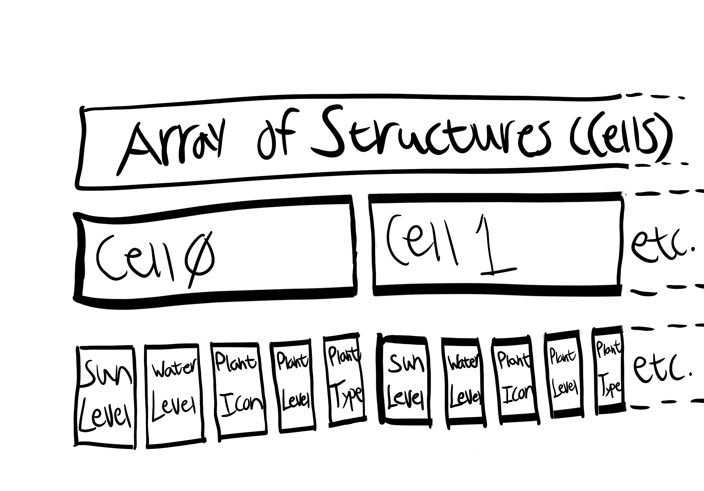

# Devlog Entry - 11/20/24

Introducing the Team
--------------------------------------------
Tools Lead: Victoria Morgan,
Engine Lead: Lo Weislak,
Design Lead: Victoria Morgan

Tools and Materials
--------------------------------------------
Our team will be using TypeScript + HTML5 for the final game. It was recommended to switch from our original platform choice, Unity.
We both have knowledge of using GitHub for version control.

Visual Studio will be the primary IDE.

We will be utilizing free, premade assets. We may use a tile editor such as Tiled.

Phaser is our alternate engine choice.

Outlook
--------------------------------------------
Our team is hoping to implement particle effects when sowing and reaping plants to add more "juice" to the game.

The visual design is going to be the most difficult part of the project. This includes making the visuals look cohesive.

We hope to gain more knowledge about implementing game systems on a short time frame.
We don't have to come up with the premise, so it'll be a good test of how to make a game based on given guidelines.

# Devlog Entry 12/05/2024

F0 complete!

How we satisfied the software requirements
--------------------------------------------

F0.a: We implemented a character you can control over a 2D grid. You can control the character with the arrow keys, and can move in any of the four cardinal directions. Movement off of the grid is restricted, with the edge of the screen functioning as a wall. Interact with plants (reap or sow) with E.

F0.b: Time passes manually in this turn-based game. Move, reap, water, or sow, every action takes up time. Every few actions (according to our TURN variable) the plants all have a chance of growing or dying from malnutrition.

F0.c: We implemented reaping and sowing nearby plants by having the player only be able to interact with the space they are currently on. Move onto a plant and interact to water or reap, move onto an empty tile to plant based on the currently selected plant seed.

F0.d: Grid cells have randomly generated sun levels and water levels, with the sun level being purely random chance and the water level accumulating over time. The higher the sun level, the more the water level drops. Increase the water level by watering the plants enough to survive.

F0.e: Each plant has a distinct type, 🥔, 🥕, or 🌽. You can select which type to plant with the on-screen buttons. Each plant has exactly three growth stages, 🌱, 🌾, and then the final harvestable stage that is equal to their plant type.

F0.f: The simple spatial rules that govern plant growth are as follows: Plants check to see if they grow every few actions. If a plant has zero water, it dies. If it doesn't die, a plant checks it's cardinal neighbors; if a neighboring plant type matches it's "desired" plant type, one level is added to the water and sun for the tile. If the plant has more than 10 water and at least 2 sun, they grow to the next stage. Planting a plant in the center of a bunch of it's desired plant thus increases sun and water a lot, making it more likely to grow to the next stage.

F0.g: Play concludes when a certain amount of plants have been successfully harvested, currently five of each. Plants can be lost but harvested ingredients cannot, meaning a player can successfully win the game by planting each plant, watering it excessively, and harvesting it five times over per plant type.

Reflection
--------------------------------------------
Our plan changed due to the software requirements of F1 and F2. Doing the project in Unity when both of us were rusty seemed like a losing proposition. We decided to switch to pure Typescript instead, as it will be easier to satisfy F2.c later on down the line, and it's been our primary programming language for this quarter. Lo satisfied most of the requirements for this stage of development, as Victoria was having difficulties with other classes and out-of-class events. Victoria's main contribution for this stage was in the design with the Design Document, and in F0.f and a little of F0.a.

# Devlog Entry 12/07/2024

F1 complete!

How we satisfied the software requirements
--------------------------------------------
F0.a: Same as last week.

F0.b: Same as last week.

F0.c: Same as last week.

F0.d: Same as last week.

F0.e: Same as last week.

F0.f: Same as last week.

F0.g: Same as last week.

F1.a: The internal state of our games grid is stored in a single contiguous array in AoS format. It is an array that stores structures, in this case our Cell objects.

F1.a.Diagram: 

F1.b: The player can manually save their progress in one of three save files, and load from each of them with six distinct buttons on the main page.

F1.c: There is a secret fourth save file that functions as an autosave, saving whenever a turn occurs (after X actions) that is automatically restored.

F1.d: Undo and redo functionality is present, similar to D2. The player can undo individual actions back to the beginning of play, which was actually somewhat tricky until we realized we needed to include the starting position of the board as well. The undoStack these game states are stored in are saved in the save files, enabling full undo functionality across saves. Undoing an action moves it to the redoStack, again similar to D2, and the player can redo their actions all the way up to the latest one. The redoStack is not saved across save states, as the redo history would be lost anyways when the player takes a diverging action other than undoing and redoing.

Reflection
--------------------------------------------
Victoria took a larger role for F1, working on the undo and redo stacks as well as the autosave and save functionalities and associated UI for F1.a, F1.c, and F1.d as well as half of F1.b. The total team effort ended up being split more 50/50, as she misunderstood F1.a and due to skipping F3 for health reasons, the saves were stored only during run time rather than being persistant. Lo thus ended up doing the majority of the work for F1.a and F1.b as a result. As Victoria has been falling behind, we have determined that she should be taking care of the devlogs and the video submissions.

# Devlog 12/08/2024

F2 complete!

How we satisfied the software requirements
--------------------------------------------

F0 + F1: All F0 and F1 requirements remain satisfied. No major code improvements were made, as we were focusing more on finishing up the functionality. Good code is very important, but unfortunately meeting the software requirements is often a more pressing concern.

F2.a: // Lo please fill out the answer here

External DSL Translation: // Lo please fill out this too

F2.b: The internal DSL is inspired by the code example given on the F2 slide. We have set it up as a long array of function calls, with a compiler function creating the functions that are being called. For example, the following function: 

function sunflower($: plantDefinition)
    $.icon("🌻");
    $.desired("🥕");
    $.button(null);
    $.growsWhen((index: number) => {
      if (index + 1 < GRID_LENGTH * GRID_WIDTH && grid[index + 1].plantLevel == null) return true;
      return false;
    });

Brackets have been removed as they were causing errors in this file. By calling .map() on the array of functions, we can then run each one through the compiler and pass in the aruguments given here. This allows us to turn all of this into an object that we can easily read from in the code! The host language used here is Typescript. Using an internal DSL like this allows us to change plants based on various values by using if statements and the like, thus controlling which exact function calls we do. This would, for example, allow us to randomly assign a Pea plant to be green and smooth, or yellow and wrinkly, without needing to mess with the rest of the code at large! But if I'm being honest, I think that just making it an object would have been better in this specific use case. We kept our gameplay rules pretty simple for this project.

External DSL Translation: In the above function sunflower(), we call it with the $: plantDefinition argument, which is the DSL language for the plants that we created. We'll call functions from the definiton, which are set up to be called by the DSL compiler.

We start with the .icon() call which sets up the type of plant to use, in this case a sunflower emoji. This not only sets the display for the plant in it's harvestable stage, but also is used internally to determine the type of plant that is planted in a cell. We then move onto the .desired() call, which works simularly to determine the type of desired neighbor that makes this plant grow better. In keeping with previous F assignments, only cardinally adjacent neighbor cells are checked. Then we have .button(), which sets up an empty property to be filled out with a clickable button to plant the seeds with.

And finally we have .growsWhen() which we took inspiration from the example for. Rather than determine specific circumstances in which the plant grows to the next stage, we have extra, more complicated scenarios that help the plant grow better. Match these up with the desired neighbors for super-fast growth! The contents of the function in .growsWhen() differ from plant to plant; for Sunflowers, it grows better when the neighboring cell to the east is empty. This means there's nothing blocking it from turning towards the sun when it rises, which is a classic trait of sunflowers.

F2.c: Unfortunately we had to skip this step for our own sanity. With the deadline approaching and Victoria having further issues, changing the code to Phaser as planned or even simply to Javascript from Typescript quickly exceeded our available scope. 

Reflection
--------------------------------------------
Our team plan has changed a lot with this assignment, with us being forced to begin to not attempt certain requirements. Both Lo and Victoria were struggling with burn out, and Victoria's difficulties from earlier were pressing down even more with other final projects being due for other classes. However, we still completed the vast majority of F2, and we are satisfied with our work. We are especially proud of this because F2 in particular ended up being surprisingly difficult compared to prior assignments.